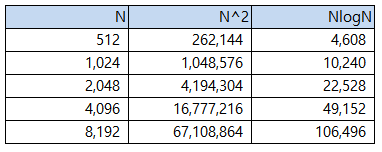

# 고속 푸리에 변환(Fast Fourier Transform, FFT) 알고리즘의 자바 구현 및 성능 평가, 응용 분석

## 소개

이 보고서는 고속 푸리에 변환(Fast Fourier Transform, FFT) 알고리즘의 자바 구현 및 성능 평가와 응용 분석에 대한 보고서입니다. FFT 알고리즘의 자바 상에서의 구현과 테스트를 진행하였으며, 이를 통해 해당 알고리즘의 성능과 응용 가능성에 대해 평가하였습니다.

## 1. 고속 푸리에 변환(FFT) 알고리즘에 대한 설명

 고속 푸리에 변환(Fast Fourier Transform, FFT)은 이산 푸리에 변환(Discrete Fourier Transform, DFT)과 그 역변환을 빠르게 수행하는 알고리즘입니다. FFT는 시간 영역의 데이터를 주파수 영역으로 변환해주는 알고리즘입니다. 주로 디지털 신호 처리에 사용하는 알고리즘입니다. 일반적으로 푸리에 변환은 DFT를 사용하여 신호를 주파수 영역으로 변환합니다. N개의 시간 영역 샘플을 N개의 주파수 영역 샘플로 변환하는데, 이 때 DFT의 계산 복잡도는 
$$
O(N^2)
$$
으로 N의 크기가 커질수록 시간이 많이 소요됩니다.

 FFT 알고리즘은 DFT의 계산 복잡도를
$$
O(NlogN)
$$
로 줄여주는 효율적인 방법입니다. FFT는 입력 신호의 길이 N을 2의 거듭제곱으로 제한합니다. 이후 복소수 계산을 위해 재귀적으로 DFT를 계산합니다. 계산의 마지막에 결과를 조합하여 최종 주파수 영역의 신호를 얻을 수 있습니다.

### 1.1 FFT 알고리즘의 기본 원리에 대한 설명

 가장 일반적으로 사용되는 FFT 알고리즘은 쿨리-튜키 알고리즘(Cooley-Tukey algorithm)입니다. 쿨리-튜키 알고리즘은 DFT를 고속 계산할 수 있게 합니다. 쿨리-튜키 알고리즘은 분할정복(Divide and Conquer)기반 알고리즘입니다. DFT는 분할정복 알고리즘을 적용할 수 있는 2가지 조건을 만족합니다.

* 조건 1: 1/2개의 데이터로 나눠서 계산 후 상수 시간 안에 합쳐서 원래 N개일 때의 값으로 도출 가능
* 조건 2: 2개의 데이터에 대해서 상수 시간 안에 계산 가능

 위 조건에 맞도록 DFT를 변형시켜 적용한 것이 쿨리-튜키 알고리즘입니다. 먼저, 길이가 N인 y(n) 데이터를 n이 짝수인 것 p(n)과 홀수인 것 q(n)으로 2개로 나눕니다. 이 때, N은 2의 거듭제곱이라고 가정하겠습니다.
$$
y(n) = \{y_0, y_1, ···, y_{N-1}\} \\→p(n) = \{y_0, y_2, ···, y_{N-1}\},\;q(n)= \{y_1, y_3, ···, y_{N-2}\}\quad0≤n≤\cfrac{N}{2}-1
$$
 이후 분할된 부분 문제에 대해 재귀적으로 계산을 진행합니다. 이 과정에서 쿨리-튜키 알고리즘을 다시 적용하여 더 작은 부분 문제로 분할하고, 이를 반복하면서 계산을 진행합니다. FFT 알고리즘에서 분할된 데이터는 복소수 배열로 구성이 되고, 이에 대한 복소수 계산을 수행합니다. 재귀적인 FFT 계산이 완료가 된 후에는 부분 문제들의 결과를 결합하여 전체 결과를 얻을 수 있습니다. 만약 입력된 데이터의 길이가 2의 거듭제곱이 아닌 경우에는 제로 패딩(Zero Padding)과 트리밍(Trimming), 보간(Interpolation) 등의 방법을 사용하여 데이터의 길이를 조정하여 2의 거듭제곱으로 만든 후 계산을 진행합니다.

### 1.2 FFT 알고리즘의 시간 복잡도 및 효율성 분석

 앞서 설명한 것처럼 FFT 알고리즘은 분할정복 방식을 사용하여 데이터를 절반으로 줄여가며 계산하므로 logN 단계의 재귀 호출을 진행하고, 이후 결합 단계를 거쳐 전체 결과를 얻습니다. 이 단계에서 복소수 계산을 수행하며, 각 단계에서 N개의 연산을 수행합니다. 이러한 과정을 통해 FFT 알고리즘의 총 시간 복잡도는 O(NlogN)임을 알 수 있습니다. 이를 O(N^2)만큼의 시간 복잡도를 가진 DFT와 비교하면 매우 효율적임 또한 알 수 있습니다. 아래의 표는 실제로 N을 대입하여 계산량을 비교하여 정리한 것입니다.

 N의 크기가 증가할수록 N^2와 NlogN의 차이가 더 많이 벌어지는데, N^2의 경우 N의 크기가 증가할수록 이러한 연산을 수행하기에 무리가 있으므로 NlogN을 사용하는 것이 나음을 알 수 있습니다. 실제로 음성 신호의 경우 N을 증가시킬수록 세밀한 주파수 분석이 가능하므로 NlogN의 연산을 수행하는 FFT가 매우 효율적이라는 것을 알 수 있습니다. 

## 2. FFT 알고리즘 구현

